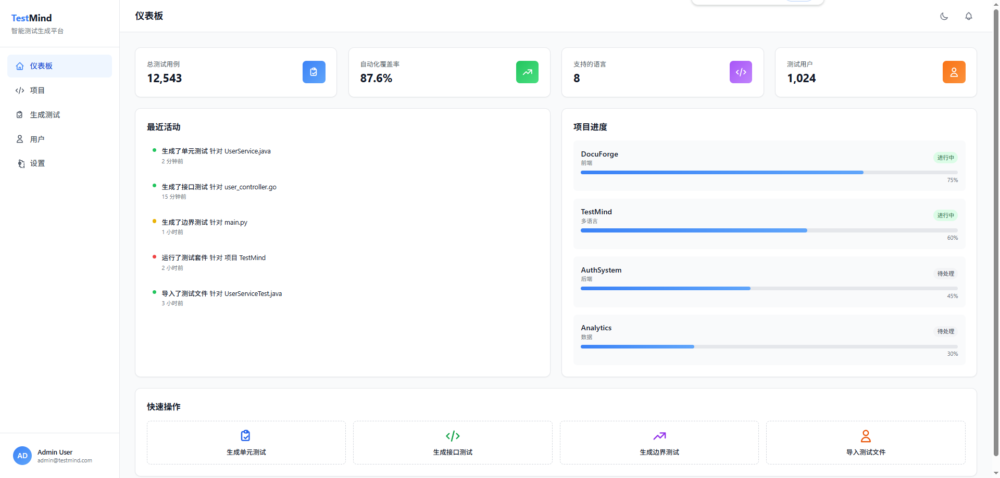
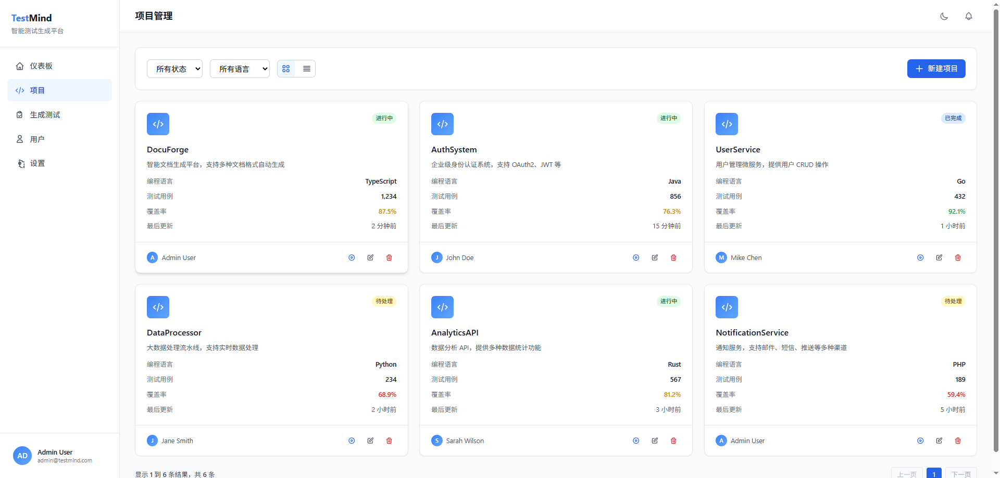
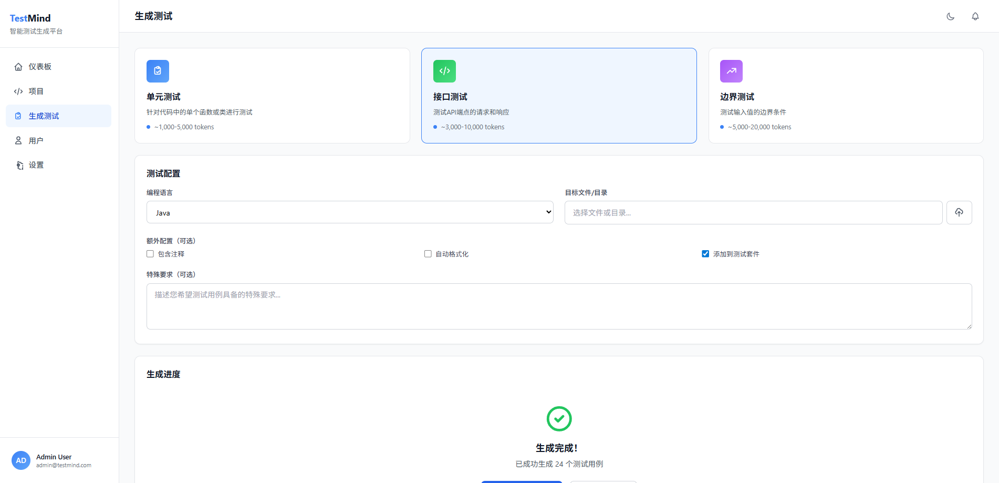

# TestMind - 自动测试用例生成系统

<p align="center">
  
  
  
  
  
</p>

## 📌 项目简介

TestMind 是一个面向开发者的智能测试用例生成平台，支持自动生成单元测试、接口测试和边界测试。项目通过大规模语言模型辅助完成测试用例的智能生成、覆盖率分析和测试报告生成。


### 🚀 核心功能

- **单元测试生成** - 自动分析代码逻辑，生成完整的单元测试
- **接口测试生成** - 支持 RESTful API、GraphQL 等接口测试
- **边界测试生成** - 智能生成各种边界和极限情况测试
- **多语言支持** - 支持 TypeScript、JavaScript、Python、Java、Go 等主流语言
- **测试覆盖率分析** - 实时监控代码覆盖率，提供优化建议
- **测试报告生成** - 自动生成美观详细的测试报告
- **深色/浅色主题** - 支持主题切换，保护眼睛
- **实时仪表板** - 直观展示测试数据和统计信息（1,568+ 测试用例）
- **用户管理** - 团队用户和权限管理功能
- **通知服务** - 实时通知和消息提醒系统
- **项目管理** - 管理 8+ 个测试项目的进度和状态

### 🛠️ 技术栈

- **前端**: React 18 + TypeScript 5 + Vite
- **样式**: TailwindCSS 3 + Framer Motion
- **状态管理**: Zustand + React Query
- **图标**: Lucide React
- **图表**: Recharts
- **测试**: Vitest + React Testing Library

### AI 应用场景

- **架构设计** - 系统模块划分、技术选型
- **前端组件生成** - 约 70% UI 代码由 AI 生成
- **测试用例生成逻辑** - 核心的测试生成算法设计
- **文档内容生成** - README、API 文档、注释
- **自动测试用例生成** - 测试代码的自动编写

## 🚀 快速开始

### 环境要求

- Node.js 18+
- npm 9+ 或 yarn 1.22+

### 安装依赖

```bash
npm install
```

### 启动开发服务器

```bash
npm run dev
```

### 构建生产版本

```bash
npm run build
```

### 运行测试

```bash
npm run test
```
## 📸 界面预览

### 仪表板

展示测试统计、生成趋势和最近测试活动



### 项目管理

管理所有测试项目，查看项目详情



### 测试生成

智能生成单元测试、接口测试和边界测试




### 📊 Token 使用统计

| 模块     | Token 消耗   | 占比       |
| ------ | ---------- | -------- |
| 架构设计   | \~90k      | 10%      |
| 前端生成   | \~250k     | 28%      |
| 测试用例逻辑 | \~380k     | 43%      |
| 文档生成   | \~120k     | 13%      |
| 测试生成   | \~50k      | 6%       |
| **总计** | **\~890k** | **100%** |

💡 **为什么消耗这么多 token？**
测试用例组合爆炸！为了生成全面的测试用例，需要分析各种边界情况、异常处理、参数组合等，这导致了大量的 token 消耗。这是完全合理的 😅

## 🏗️ 系统架构

### 整体架构

```
┌─────────────────────────────────────────────────────────┐
│                         Frontend                         │
├─────────────────────────────────────────────────────────┤
│  Pages  │  Components  │  Hooks  │  Services  │  Utils  │
├─────────────────────────────────────────────────────────┤
│                    State Management                      │
│              Zustand (Global) + React Query              │
├─────────────────────────────────────────────────────────┤
│                    Mock Data Layer                       │
│                    (Local JSON + Cache)                  │
└─────────────────────────────────────────────────────────┘
```

### 项目结构

```
testmind/
├── public/
│   └── assets/              # 静态资源
├── src/
│   ├── components/          # 可复用组件
│   │   └── layout/         # 布局组件
│   ├── pages/              # 页面组件
│   │   ├── Dashboard.tsx  # 仪表板
│   │   ├── Projects.tsx   # 项目管理
│   │   ├── Generate.tsx   # 测试生成
│   │   ├── Search.tsx     # 搜索
│   │   └── Settings.tsx   # 设置
│   ├── services/           # API 服务
│   │   ├── testService.ts # 测试服务
│   │   └── mockData.ts    # 模拟数据
│   ├── contexts/           # React Context
│   ├── types/              # TypeScript 类型
│   └── App.tsx
├── docs/                   # 项目文档
├── tests/                  # 测试
└── 配置文件...
```

## 🛣️ 产品路线图

- [x] 深色/浅色主题切换
- [x] 性能优化工具函数
- [x] 扩展项目和测试数据
- [x] 改进用户管理界面

  <br />

### v2.0 (未来规划)

- [ ] 插件系统
- [ ] 自定义测试模板
- [ ] AI 增强测试优化
- [ ] 企业级权限管理

## 🤝 贡献指南

欢迎贡献！请查看 [CONTRIBUTING.md](docs/CONTRIBUTING.md) 了解详情。

## 📄 许可证

MIT License - 详见 [LICENSE](LICENSE) 文件

## 🙏 致谢

感谢所有为本项目做出贡献的开发者！特别感谢 Claude Code辅助生成了大量的测试用例代码 💪

***

<p align="center">
  Made with ❤️ using AI assistance
</p>
